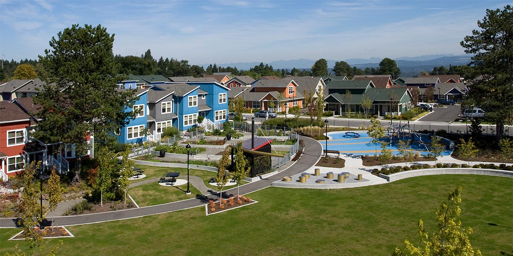

# King County Housing with Multiple Regression

Renaissance Realty is a distinguished and prestigious real estate firm that specializes in facilitating property transactions for homeowners. Our team has been assigned to analyze housing data in King County and predict house sale prices for a housing development agency.
After conducting numerous linear regression models, we've identified crucial factors that contribute to higher property values. Our analysis indicates that square footage of living space and building grade are paramount variables. By leveraging these insights, our goal is to help the company make informed decisions, highlighting attributes such as spacious living areas, high-quality construction, and desirable amenities to maximize returns in the fiercely competitive King County housing market.

## Project Overview

For this project,  we used multiple linear regression modeling to analyze house sales in King County county.

### Business Problem

The current business problem is to come up with data driven solutions that can give potential homeowners insight on the best possible investments when it comes to buying or selling houses. Reinassance Realty are keen on identifying the factors that significantly influence higher home sale prices. In our analysis, we will assess, square footage of living space, and elements, including proximity to the waterfront, the grade and condition of the houses. The goal is to pinpoint the key qualities that correlate strongly with elevated home sale prices, enabling strategic decision-making in our projects.

### The Data

We got information from the King County House Data [data set](./data/kc_house_data.csv), a dataset given to us at the start of the project. This file has details about 21,597 homes in King County It includes info on things like the number of bedrooms/bathrooms, floors, square footage, zip code, and condition of each home.

## Methodology
We used simple linear regression and multiple linear regression to analyze the data. 

#### Data understanding 
We investigated the data to identify:
- Missing data -we identified the null values in the columns as ,square foot basement,view, waterfront, and year renovated
- Checked for the incorrect data types 
- Distribution of the data- we plotted histograms and bar plots.
- Key statistical measures such as mean, mode, standard deviation etc

#### Data preparation
- We dropped unnecessary columns eg the Id column
- Replaced null values with appropriate values eg Waterfront and View was replaced with the mode of the data.
- Replaced null entries in the Square foot basement column with 0 and converted it to a numerical data type.
- We encoded categorical columns into a  numerical representation for the model to be easily understood 

## Modelling

The results were as below:

#### Model 1
This is the first model it takes the price versus sqft_living as feature. We create a simple linear regression baseline model using two variables, **price**(target) and **square footage of the living space** in a home.

#### Model 2
We have included grade, waterfront and condition as they are categorical features in the dataset.

#### Model 3
We attempted a new model that included sqft_living, bathrooms, and bedrooms as features.

#### Model 4
Referencing from the above model, we added grade feature.

#### Model 5
Checking for multicolinearity in numerical variables which was present in sqft living and bathrooms and sqft living and sqft above.

## Results
The results of our complete analysis were as follows;

Model 1 The feature square footage living space which is highly correlated with prices for the house has a highest impact on the R-squared.

Model 2 Waterfront presence positively influences house prices, indicating higher prices for houses with a waterfront.

Building grade exhibits a strong positive correlation with house prices, with higher-grade categories associated with elevated property values.

Lower-grade categories in building grades are negatively correlated, implying that houses with lower grades tend to have lower prices.

The 'Fair' condition category negatively impacts house prices, suggesting that houses in fair condition are associated with lower values.

Moderate condition categories show coefficients indicating moderate impacts on house prices, reflecting their influence on property values.

Model 3 The features bedrooms brings about a decrease in price while for the feature bathrooms it brings about an additional increase in price.

Model 4 The features bedrooms and bathrooms was negatibely correlated with the house prices, analysis shows additional of these features led to decrease in price this is due to the inclusion of the feature grade.

Houses with an excellent grade (grade_11) are estimated to have a higher price while houses with grades below 10 (Poor, Low, Fair, Low Average, Average, Good, Better) are estimated to have lower prices compared to those with a grade of 10.

Model 5 sqft_living is highly correlated with bathrooms and sqft_above. These features will be dropped from the predictive model due to collinearity.

Our categorical features i.e waterfront and condition show that they have a low level of multicolinearity hence they are okay. But grade_7 Average and grade_8 Good have a high level of multicolinearity.

The interaction between bathrooms and grade was significant accounting for improvement of the model.

## Conclusion and recommendations

Our best model which is model 2, had an R-squared value of 0.626, telling us that the model fit the data with an accuracy of 63%.

Square foot of living space, building grade, waterfront and condition all play a valuable role in predicting the price of a house in King County.

The prob(F-statistic) of 0.00 tells us that our regression is meaningful. With ans alpha of 0.05, our p-values for our features are well below our alpha or significance level, showing that they are each contributing to the model significantly.

Our recommendations are as follows:

Increasing the square-footage of living space* Focus on increaing the sqaure footage of the living spaces this is because larger living spaces attract higher prices in the real estate market.

Attain the highest possible building grade* Achieve the highest possible grade for houses because high quality construction whith high end grade attracts customers hence increases the prices of the houses.

Build and develop homes in close proximity to the waterfront* From the data we have discovered that waterfronts are desired by most customers this is because waterfronts can offer very scenic views. Investing in properties which are near waterfronts will attract higher prices in the real estaste market.

Attain the highest possible condition* The condition of a house greatly impacts the value of a house. Achieving the highest possible condition of the house such as regualr mainetnance and upgrades of the house, the aesthetics will greatly impact the value of the house.

By following the above recommendations, Renaissance Realty can increase their chances of selling higher-priced homes home-owners selling their houses will get higher return on investments.

## Future work
In the future, our next steps would be;

Ensuring that the grade and condition of the houses have been attained.

Investigate features other than waterfront such as proximity to social amenities, that would increase the property values of the houses. Analyze the market data and identify emerging trends and preferences.

Conducting feedbacks and surveys- Gather feedbacks from homebuyers and clients to gain insight into the factors that influence their decision of purchasing houses.

Collaboration and Partnership - Collaborating with other real estate companies and investors to gain insight and knowledge on emerging trends in the real estate market.

By implementing these recommendations and further analyses, Renaissance Realty can confidently help their clients sell high value properties and help homeowners improve and renovate their houses in order to get higher return on investments.
 
 
 For more info please review our full analysis in: [renaissance realty notebook](./renaissance_realty_notebook.ipynb) and [slides](./presentation.pdf)

## Authors
1. Mercy Ronoh
2. Ashley Simiyu
3. Andrew Maina
4. Tasha Kanyiva
5. Diana Mbuvi
